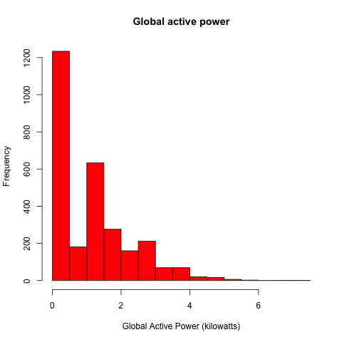
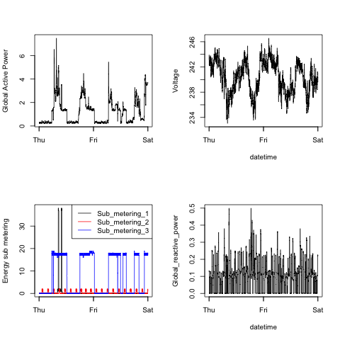

# Exploratory Data Analysis: Course Project 1

This is the repository of the [first
assignment](https://github.com/rdpeng/ExData_Plotting1) of _Exploratory Data
Analysis_, the fourth course of the [Johns Hopkins University and Coursera
Specialization in Data Science](https://www.coursera.org/specialization/jhudatascience/1).

## Plots

