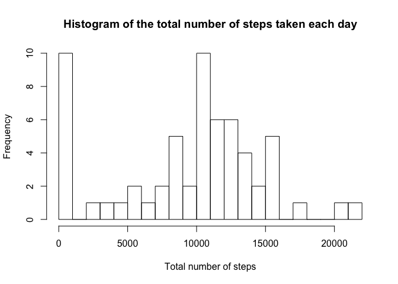
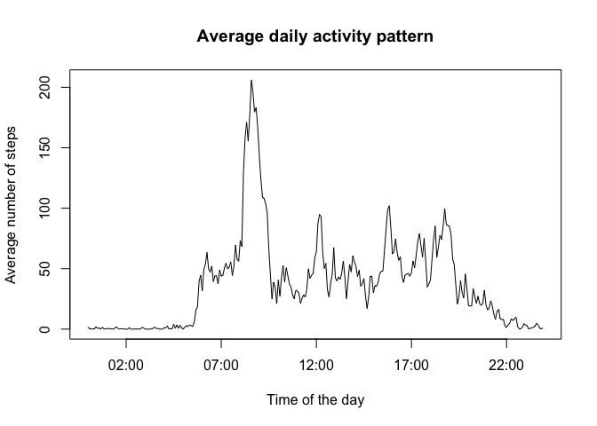
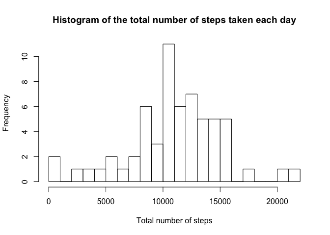
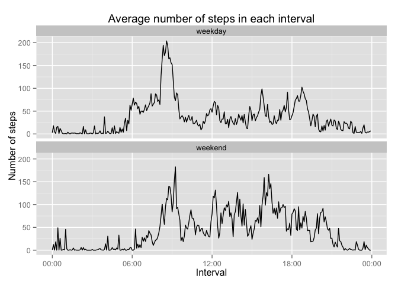

# Reproducible Research: Peer Assessment 1

The full assignment description can be found in the [README](README.md) file,
from where the following assignment and dataset description are reproduced.

This assignment makes use of data from a personal activity monitoring device.
This device collects data at 5 minute intervals through out the day. The data
consists of two months of data from an anonymous individual collected during the
months of October and November, 2012 and include the number of steps taken in 5
minute intervals each day.

The variables included in the dataset are:

* **steps**: Number of steps taken in a 5-minute interval (missing values are
  coded as `NA`)

* **date**: The date on which the measurement was taken in YYYY-MM-DD format

* **interval**: Identifier for the 5-minute interval in which the measurement
  was taken

Let us use some packages (you may need to install them if you do not have them).

```r
library(dplyr, quietly = TRUE, verbose = FALSE, warn.conflicts = FALSE)
library(ggplot2, quietly = TRUE, verbose = FALSE, warn.conflicts = FALSE)
library(mice, quietly = TRUE, verbose = FALSE, warn.conflicts = FALSE)
```

```
## mice 2.22 2014-06-10
```

## Loading and preprocessing the data

We first extract the dataset from the zip file (unless it already exists) and
load it.


```r
if (!file.exists("activity.csv")) {
  unzip("activity.zip")
}
activity <- read.csv("activity.csv",
                     colClasses = c("integer", "Date", "integer"))
```

The `activity$interval` variable stores the hour and minute interval in which
the measurement was taken. We convert it to a format HH:MM so it can then be
mixed with the `activity$date` variable to create a new `activity$date.time`
variable.


```r
interval.string <- sprintf("%04s", activity$interval)
interval.string <- sub("(\\d\\d)(\\d\\d)", "\\1:\\2" , interval.string,
                       perl = TRUE)
activity$date.time <- as.POSIXct(strptime(paste(activity$date, interval.string),
                                          "%Y-%m-%d %H:%M"))
```

## What is the mean total number of steps taken per day?

As specified in the assignment description, in this section we simply ignore the
missing values. Let us summarise the activity by computing the total number of
steps taken each day. We then plot a histogram of this variable.


```r
activity.by.day <- group_by(activity, date)
activity.by.day <- summarise(activity.by.day,
                           total.steps = sum(steps, na.rm = TRUE))
hist(activity.by.day$total.steps, breaks = 20,
     main = "Histogram of the total number of steps taken each day",
     xlab = "Total number of steps")
```

 

Note that there is a high frequency in the first bin due to some days having
only `NA` values.

We can also get the mean and median.


```r
steps.per.day.mean <- mean(activity.by.day$total.steps)
steps.per.day.median <- median(activity.by.day$total.steps)
```

And obtain a mean of 9354 and a median
of 10395.

## What is the average daily activity pattern?

We turn now to analise the daily activity pattern, that is the number of steps
the individual takes in each 5-minutes interval, average over all days. Hence,
we now group the activity by interval and calculate the mean. (Note that, again,
we ignore the `NA` values.)


```r
activity.by.interval <- group_by(activity, interval)
activity.by.interval <- summarise(activity.by.interval,
                                  mean.steps = mean(steps, na.rm = TRUE))
interval.string <- sprintf("%04s", activity.by.interval$interval)
interval.string <- sub("(\\d\\d)(\\d\\d)", "\\1:\\2" , interval.string,
                       perl = TRUE)
activity.by.interval$time <- as.POSIXct(strptime(interval.string, "%H:%M"))
plot(activity.by.interval$time, activity.by.interval$mean.steps, type = "l",
     main = "Average daily activity pattern",
     xlab = "Time of the day", ylab = "Average number of steps")
```

 

The maximum number of steps is observed in the morning, or more precisely at:


```r
interval <- activity.by.interval$interval[which.max(
  activity.by.interval$mean.steps)]
sub("(\\d\\d)(\\d\\d)", "\\1:\\2" , sprintf("%04s", interval), perl = TRUE)
```

```
## [1] "08:35"
```

## Imputing missing values

Note that there are a number of days/intervals where there are missing values.


```r
sum(is.na(activity$steps))
```

```
## [1] 2304
```

We will use the Multiple Imputation by Chained Equations (mice) package to fill
in the missing data. In order to do so we need numeric values, so we will first
create a new data frame with numeric values for two relevant variables: weekday
and time of the day.


```r
weekday <- as.integer(strftime(activity$date.time, "%u"))
hour <- as.integer(strftime(activity$date.time, "%H"))
minute <- as.integer(strftime(activity$date.time, "%M"))
activity.num <- data.frame(activity$steps, weekday, hour, minute)
colnames(activity.num) <- c("steps", "weekday", "hour", "minute")
```

Now we perform the imputation, and save the results to a new data frame called
`imputed` that is identical to the original `activity`, but with the missing
values filled. Note that we set a random seed so the results are reproducible.


```r
set.seed(1)
activity.num <- complete(mice(activity.num))
imputed <- activity
imputed$steps <- activity.num$steps
```

We can now plot the histogram of the new imputed data and calculate the mean and
median total number of steps taken per day, as we did before.


```r
imputed.by.day <- group_by(imputed, date)
imputed.by.day <- summarise(imputed.by.day,
                            total.steps = sum(steps, na.rm = TRUE))
hist(imputed.by.day$total.steps, breaks = 20,
     main = "Histogram of the total number of steps taken each day",
     xlab = "Total number of steps")
```

 

```r
imputed.steps.per.day.mean <- mean(imputed.by.day$total.steps)
imputed.steps.per.day.median <- median(imputed.by.day$total.steps)
```

The obtained mean and median are
10969 and
11015, respectively. We can
compare them to the previous values of the mean
(9354) and the median
(10395). The new mean and median are
bigger than the original values, because the new dataset has a higher number of
steps in all days that originally had `NA` values.

## Are there differences in activity patterns between weekdays and weekends?

We already have the information about the weekday in `weekday` as a decimal
number (1-7, Monday is 1). Let us add a new factor variable to `imputed` with
two levels, "weekday" and "weekend".


```r
imputed$day.type <- factor(weekday <= 5, levels = c(TRUE, FALSE),
                           labels = c("weekday", "weekend"))
```

Now we can compare the average number of steps taken in each 5-minutes interval,
discriminating between weekdays and weekends.


```r
imputed.by.day.type <- group_by(imputed, day.type, interval)
imputed.by.day.type <- summarise(imputed.by.day.type,
                                 mean.steps = mean(steps, na.rm = TRUE))
interval.string <- sprintf("%04s", imputed.by.day.type$interval)
interval.string <- sub("(\\d\\d)(\\d\\d)", "\\1:\\2" , interval.string,
                       perl = TRUE)
imputed.by.day.type$time <- as.POSIXct(strptime(interval.string, "%H:%M"))

g <- ggplot(imputed.by.day.type, aes(x = time, y = mean.steps))
g <- g + scale_x_datetime(labels = function(x) format(x, "%H:%M"))
g <- g + geom_line() + facet_wrap(~ day.type, ncol = 1)
g + labs(title = "Average number of steps in each interval",
         x = "Interval", y = "Number of steps")
```

 
