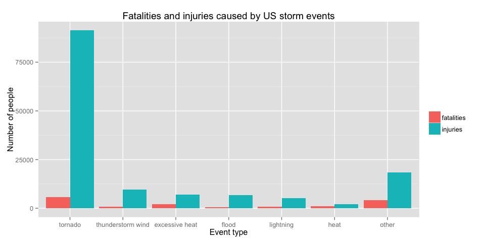
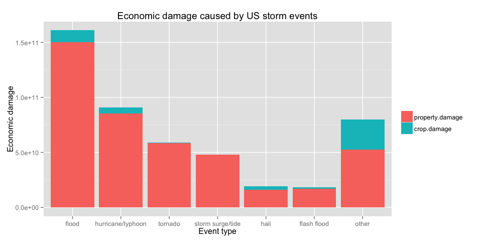

# Impact of Storms to US Population and Ecomony
Martí Cuquet  

## Synopsis

This report summarises the Storm Events Database to find the event types with
the most harmful consequences to both the population health (in terms of
injuries and fatalities) and to the economy (in terms of economic damage). The
dataset consists of 902 297 observations between 1950 and November 2011. The
analysis shows that tornadoes cause more fatalities and injuries than all the
other events together. It also shows that flood causes more economic damage than
any other event. Finally, in terms of crop damage only, the most harmful event
is drought.

## Data Processing

We use the [Storm Events Database](https://www.ncdc.noaa.gov/stormevents/) of
the U.S. National Oceanic and Atmospheric Administration's (NOAA). The data can
be obtained from the [Reproducible Research course
website](https://d396qusza40orc.cloudfront.net/repdata%2Fdata%2FStormData.csv.bz2)
(47Mb). It includes events between 1950 and November 2011.

We will also use the "dplyr" and "ggplot2" packages.


```r
library(dplyr)
library(tidyr)
library(ggplot2)

stormdf <- read.csv("repdata_data_StormData.csv.bz2")
```

### Clean event types

The type of event, encoded in the variable `EVTYPE`, contains extra spaces,
typos and incosistencies in the capitalisation, which lead to events of the
same type to be classified as different. Only the more recent events are
classified consistently according to the [National Weather Service Storm Data
Documentation](https://d396qusza40orc.cloudfront.net/repdata%2Fpeer2_doc%2Fpd01016005curr.pdf), which are:


```r
types.std <- c("Astronomical Low Tide", "Avalanche", "Blizzard",
               "Coastal Flood", "Cold/Wind Chill", "Debris Flow", "Dense Fog",
               "Dense Smoke", "Drought", "Dust Devil", "Dust Storm",
               "Excessive Heat", "Extreme Cold/Wind Chill", "Flash Flood",
               "Flood", "Freezing Fog", "Frost/Freeze", "Funnel Cloud", "Hail",
               "Heat", "Heavy Rain", "Heavy Snow", "High Surf", "High Wind",
               "Hurricane/Typhoon", "Ice Storm", "Lakeshore Flood",
               "Lake-Effect Snow", "Lightning", "Marine Hail",
               "Marine High Wind", "Marine Strong Wind",
               "Marine Thunderstorm Wind", "Rip Current", "Seiche", "Sleet",
               "Storm Surge/Tide", "Strong Wind", "Thunderstorm Wind",
               "Tornado", "Tropical Depression", "Tropical Storm", "Tsunami",
               "Volcanic Ash", "Waterspout", "Wildfire", "Winter Storm",
               "Winter Weather")
types.std <- tolower(types.std)
```

If we consider only the event types that match these event names, we ignore many
observations.


```r
num.ignored.obs = nrow(stormdf) - sum(tolower(stormdf$EVTYPE) %in% types.std)
```

This means we have 266858 ignored observations, ie around
30% of the total.

We hence standarise the type names by transforming all characters to lower-case
characters, removing extra spaces and then correcting typos and changing the
name to a valid type (according to the documentation) whenever it is clear how
to do it. Finally, there is also an event with type `"?"`, which we change to
`NA`. The new event types are encoded in the variable `TYPE`, so the original
information is still available.


```r
stormdf$TYPE <- as.character(stormdf$EVTYPE)
stormdf$TYPE <- sub("^ +", "", stormdf$TYPE)
stormdf$TYPE <- gsub("  ", "", stormdf$TYPE)
stormdf$TYPE <- tolower(stormdf$TYPE)

stormdf$TYPE <- gsub(" & ", "/", stormdf$TYPE)
stormdf$TYPE <- gsub(" ?- ", "/", stormdf$TYPE)
stormdf$TYPE <- gsub(" and ", "/", stormdf$TYPE)
stormdf$TYPE <- sub("[/-]$", "", stormdf$TYPE)

stormdf$TYPE[grep("^avalanch?e$", stormdf$TYPE)] <- "avalanche"
stormdf$TYPE[grep("^(beach )?(erosion/)?(coastal|cstl) ?flood(ing|ing/erosion)?$",
                  stormdf$TYPE)] <- "coastal flood"

stormdf$TYPE[grep("^cold$|unseasonabl. cold|high winds/cold|cold/wet conditions",
                  stormdf$TYPE)] <- "cold/wind chill"
stormdf$TYPE[grep("debris flows?|landslide|mudslide", stormdf$TYPE)] <-
  "debris flow"
stormdf$TYPE[grep("^(patchy dense )?fog$", stormdf$TYPE)] <- "dense fog"
stormdf$TYPE[grep("drought", stormdf$TYPE)] <- "drought"
stormdf$TYPE[grep("(excessive|extreme|record) heat", stormdf$TYPE)] <-
  "excessive heat"
stormdf$TYPE[grep("heat waves?$", stormdf$TYPE)] <-
  "excessive heat"
stormdf$TYPE[grep("(extreme|record) (cold|windchill)", stormdf$TYPE)] <-
  "extreme cold/wind chill"
stormdf$TYPE[grep("flash flood", stormdf$TYPE)] <- "flash flood"
stormdf$TYPE[grep("fld|(river|major|urban|ice jam|snowmelt) flood(ing)?|urban/small stream flood|^(tidal )?flooding$|^floods?",
                  stormdf$TYPE)] <- "flood"
stormdf$TYPE[grep("(fog/cold temperatures|ice fog)", stormdf$TYPE)] <-
  "freezing fog"
stormdf$TYPE[grep("^ic[ey] (on )?roads?|frost|^(black ice|glaze|ice)$|^(damaging | agricultural |hard )?freeze",
                  stormdf$TYPE)] <- "frost/freeze"
stormdf$TYPE[grep("^(small )?hail", stormdf$TYPE)] <- "hail"
stormdf$TYPE[grep("(abnormal|unseasonably) warm|warm weather",
                  stormdf$TYPE)] <- "heat"
stormdf$TYPE[grep("excessive rainfall|mixed precip|torrential rainfall|^rain(/snow)?$|^heavy rain",
                  stormdf$TYPE)] <- "heavy rain"
stormdf$TYPE[grep("^snow( squall)?$|(blowing|excessive|falling|heavy|light) snow|snow/ice|ice/snow$",
                  stormdf$TYPE)] <- "heavy snow"
stormdf$TYPE[grep("^(beach|coastal) erosio?n$|surf", stormdf$TYPE)] <-
  "high surf"
stormdf$TYPE[grep("^wind$|^high wind|non-severe wind damage", stormdf$TYPE)] <-
  "high wind"
stormdf$TYPE[grep("hurricane|typhoon", stormdf$TYPE)] <- "hurricane/typhoon"
stormdf$TYPE[grep("ice storm", stormdf$TYPE)] <- "ice storm"
stormdf$TYPE[grep("^lig[hn]tn?ing", stormdf$TYPE)] <- "lightning"
stormdf$TYPE[grep("high wind/seas", stormdf$TYPE)] <- "marine high wind"
stormdf$TYPE[grep("^marine (tstm|thunderstorm)", stormdf$TYPE)] <-
  "marine thunderstorm wind"
stormdf$TYPE[grep("rip current", stormdf$TYPE)] <- "rip current"
stormdf$TYPE[grep("^(light |sleet/|snow)?freezing (drizzle|rain)",
                  stormdf$TYPE)] <- "sleet"
stormdf$TYPE[grep("storm surge", stormdf$TYPE)] <- "storm surge/tide"
stormdf$TYPE[grep("gusty wind|^non.tstm wind|strong winds|^winds$",
                  stormdf$TYPE)] <- "strong wind"
stormdf$TYPE[grep("^tstm|^th?un?dee?rstorms?|mi(cr|rc)oburst|^severe thunderstorm",
                  stormdf$TYPE)] <- "thunderstorm wind"
stormdf$TYPE[grep("^torndao|^tornado", stormdf$TYPE)] <- "tornado"
stormdf$TYPE[grep("tropical storm", stormdf$TYPE)] <- "tropical storm"
stormdf$TYPE[grep("volcanic", stormdf$TYPE)] <- "volcanic ash"
stormdf$TYPE[grep("^way?ter ?spout", stormdf$TYPE)] <- "waterspout"
stormdf$TYPE[grep("fire", stormdf$TYPE)] <- "wildfire"
stormdf$TYPE[grep("^winter storm|snow/high winds|thundersnow",
                  stormdf$TYPE)] <- "winter storm"
stormdf$TYPE[grep("winte?ry? (weather|mix)", stormdf$TYPE)] <- "winter weather"
```

We can now create two datasets, one (`clean`) with events whose type match an
offically valid name, and a second (`other`) with the remaining events. We
finally set the event type of all the events in this second dataset to "other"
and bind it with the (`clean`) dataset.


```r
clean <- stormdf %>% filter(TYPE %in% types.std)
other <- stormdf %>% filter(!(TYPE %in% types.std))
other$TYPE <- "other"
clean <- rbind(clean, other)
```

After this data processing, only 1655 observations are ignored (ie
labelled as "other"), which makes a
0.1834% of the total.

### Process damage magnitudes

The `PROPDMG` and `CROPDMG` variables, which respectively encode the property
and crop damage, have to be multiplied by the corresponding factor (thousand
"K", million "M", and billion "B") taken from the variables `PROPDMGEXP` and
`CROPDMGEXP`. We do this and keep only the relevant variables of the dataset.


```r
clean$PROPDMGEXP <- (!(clean$PROPDMGEXP %in% c("k", "K"))) * 1 +
  (clean$PROPDMGEXP %in% c("k", "K")) * 10^3 +
  (clean$PROPDMGEXP %in% c("m", "M")) * 10^6 +
  (clean$PROPDMGEXP %in% c("b", "B")) * 10^9
clean$CROPDMGEXP <- (!(clean$CROPDMGEXP %in% c("k", "K"))) * 1 +
  (clean$CROPDMGEXP %in% c("k", "K")) * 10^3 +
  (clean$CROPDMGEXP %in% c("m", "M")) * 10^6 +
  (clean$CROPDMGEXP %in% c("b", "B")) * 10^9

clean <- transmute(clean, event.type = TYPE,
                   fatalities = FATALITIES,
                   injuries = INJURIES,
                   property.damage = PROPDMG * PROPDMGEXP,
                   crop.damage = CROPDMG * CROPDMGEXP)
```

### Aggregate data

The last part of the data processing summarizes the fatalities, injuries and
property and crop damage by event type.


```r
summ <- clean %>%
  group_by(event.type) %>%
  summarise(fatalities = sum(fatalities),
            injuries = sum(injuries),
            property.damage = sum(property.damage),
            crop.damage = sum(crop.damage))
```

As a final check, we want to make sure that we did not miss any important event
type when we coarse-grained all remaining non-official events as "other". In
order to do that, we sum all the columns and compare these values with the most
dangerous type of events according to each of the four measures.


```r
colSums(subset(clean, event.type == "other")[-1])
```

```
##      fatalities        injuries property.damage     crop.damage 
##              85              29        27246135       187419986
```

As we can see, it is not enough to make an impact into the ordering of the more
dangerous events:


```r
apply(clean[, -1], 2, function(x) head(sort(x, decreasing = TRUE)))
```

```
##      fatalities injuries property.damage crop.damage
## [1,]        583     1700       1.150e+11  5000000005
## [2,]        158     1568       3.130e+10  5000000005
## [3,]        116     1228       1.693e+10  1510000002
## [4,]        114     1150       1.126e+10  1000000001
## [5,]         99     1150       1.000e+10   596000596
## [6,]         90      800       7.350e+09   578850579
```

So we can conclude that we are not missing anything important after the
processing of the data.

## Results

With the processed data we are ready to answer the following two questions:

1. Across the United States, which types of events are most harmful with respect
   to population health?
2. Across the United States, which types of events have the greatest economic
   consequences?

To answer the first question, we select the six event types with the highest sum
of fatalities and injuries, and prepare them in a data frame ready to be plotted.
We also add in the remaining event types as "other".


```r
summ.long <- summ %>%
  select(event.type, fatalities, injuries) %>%
  arrange(desc(fatalities + injuries))
summ.long$event.type <- factor(summ.long$event.type,
                               levels = summ.long$event.type)
summ.long <- rbind(summ.long[1:6, ],
                   summarise(summ.long[-(1:6), ], event.type = "other",
                             fatalities = sum(fatalities),
                             injuries = sum(injuries)))
summ.long <- summ.long %>% gather(damage, quantity, c(fatalities, injuries))

g1 <- ggplot(data = summ.long, aes(x = event.type, y = quantity, fill = damage))
g1 <- g1 + geom_bar(stat = "identity", position = "dodge")
g1 <- g1 +
  ggtitle("Fatalities and injuries caused by US storm events") +
  xlab("Event type") +
  ylab("Number of people") +
  scale_fill_discrete(name = "")
```

The results can be seen in the following figure. The most harmful event type is
tornado, causing more fatalities and injuries than all the other events. It is
followed by thunderstorm wind and excessive heat.


```r
print(g1)
```

 

Taking a similar approach, we can order the events by decreasing economic
damage.


```r
summ.long <- summ %>% select(event.type, property.damage, crop.damage) %>% arrange(desc(property.damage + crop.damage))
summ.long$event.type <- factor(summ.long$event.type, levels = summ.long$event.type)
summ.long <- rbind(summ.long[1:6, ], summarise(summ.long[-(1:6), ], event.type = "other", property.damage = sum(property.damage), crop.damage = sum(crop.damage)))
summ.long <- summ.long %>% gather(damage, quantity, c(property.damage, crop.damage))

g2 <- ggplot(data = summ.long, aes(x = event.type, y = quantity, fill = damage))
g2 <- g2 + geom_bar(stat = "identity", position = "stack")
g2 <- g2 +
  ggtitle("Economic damage caused by US storm events") +
  xlab("Event type") +
  ylab("Economic damage") +
  scale_fill_discrete(name = "")
```

The results can be seen in the following figure. The most harmful event type in
terms of economic damage are floods, followed by hurricanes or typhoons and
tornados.


```r
print(g2)
```

 

It is also interesting to note that in terms of crop damage only (that is, excluding property damage), the most harmful event is drought.


```r
summ$event.type[which.max(summ$property.damage)]
```

```
## [1] "flood"
```

## Conclusions

As a summary, we can conclude that tornados are by far the most harmful events
to people, and have also important consequences in terms of economic damage. In
terms of economic consequences, however, the most harmful events are floods and
hurricanes and typhoons.
